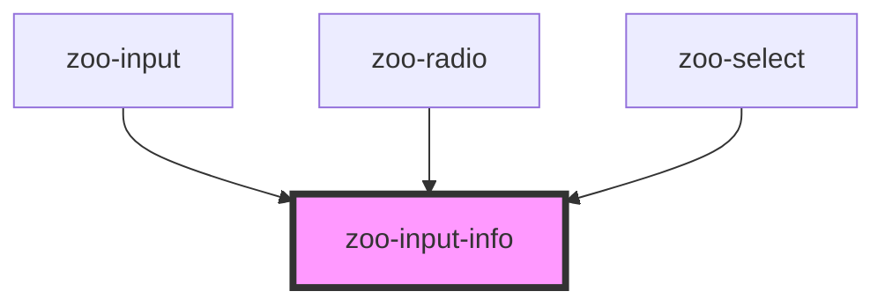

# zoo-input-info

<!-- Auto Generated Below -->

## Properties

| Property   | Attribute  | Description | Type      | Default |
| ---------- | ---------- | ----------- | --------- | ------- |
| `errormsg` | `errormsg` |             | `string`  | `''`    |
| `text`     | `text`     |             | `string`  | `''`    |
| `valid`    | `valid`    |             | `boolean` | `true`  |

## Dependencies

### Used by

 - [zoo-input](..\..\zoo-input)
 - [zoo-radio](..\..\zoo-radio)
 - [zoo-select](..\..\zoo-select)

### Graph

----------------------------------------------

*Built with [StencilJS](https://stenciljs.com/)*
