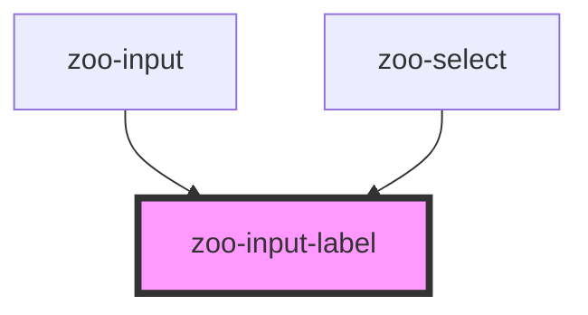

# zoo-input-label

<!-- Auto Generated Below -->

## Properties

| Property | Attribute | Description | Type      | Default |
| -------- | --------- | ----------- | --------- | ------- |
| `text`   | `text`    |             | `string`  | `''`    |
| `valid`  | `valid`   |             | `boolean` | `true`  |

## Dependencies

### Used by

 - [zoo-input](../../zoo-input)
 - [zoo-select](../../zoo-select)

### Graph

----------------------------------------------

*Built with [StencilJS](https://stenciljs.com/)*
