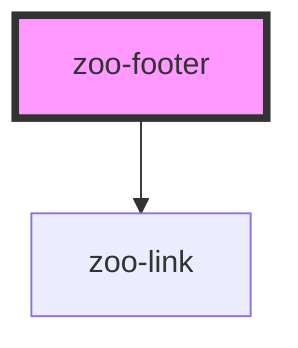

# zoo-footer

<!-- Auto Generated Below -->

## Properties

| Property    | Attribute   | Description | Type     | Default |
| ----------- | ----------- | ----------- | -------- | ------- |
| `copyright` | `copyright` |             | `string` | `''`    |
| `links`     | --          |             | `any[]`  | `[]`    |

## Dependencies

### Depends on

- [zoo-link](..\zoo-link)

### Graph

----------------------------------------------

*Built with [StencilJS](https://stenciljs.com/)*
