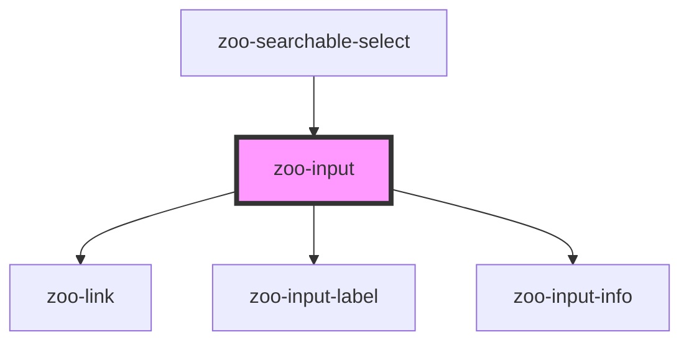

# zoo-input

<!-- Auto Generated Below -->

## Properties

| Property        | Attribute       | Description | Type      | Default         |
| --------------- | --------------- | ----------- | --------- | --------------- |
| `errormsg`      | `errormsg`      |             | `string`  | `''`            |
| `infotext`      | `infotext`      |             | `string`  | `''`            |
| `label`         | `label`         |             | `string`  | `''`            |
| `labelposition` | `labelposition` |             | `string`  | `'top'`         |
| `linkhref`      | `linkhref`      |             | `string`  | `''`            |
| `linktarget`    | `linktarget`    |             | `string`  | `'about:blank'` |
| `linktext`      | `linktext`      |             | `string`  | `''`            |
| `nopadding`     | `nopadding`     |             | `boolean` | `false`         |
| `valid`         | `valid`         |             | `boolean` | `true`          |

## Dependencies

### Used by

 - [zoo-searchable-select](../zoo-searchable-select)

### Depends on

- [zoo-link](../zoo-link)
- [zoo-input-label](../shared/zoo-input-label)
- [zoo-input-info](../shared/zoo-input-info)

### Graph

----------------------------------------------

*Built with [StencilJS](https://stenciljs.com/)*
