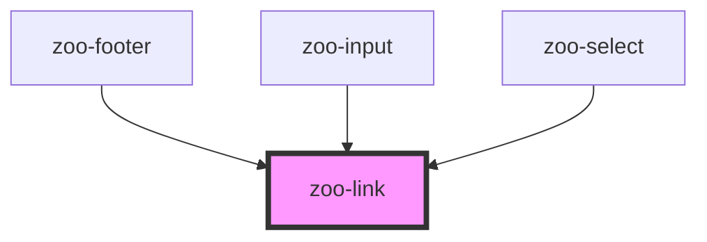

# zoo-link

<!-- Auto Generated Below -->

## Properties

| Property    | Attribute   | Description | Type      | Default         |
| ----------- | ----------- | ----------- | --------- | --------------- |
| `disabled`  | `disabled`  |             | `boolean` | `false`         |
| `href`      | `href`      |             | `string`  | `""`            |
| `target`    | `target`    |             | `string`  | `"about:blank"` |
| `text`      | `text`      |             | `string`  | `""`            |
| `textalign` | `textalign` |             | `string`  | `'center'`      |
| `type`      | `type`      |             | `string`  | `"standard"`    |

## Dependencies

### Used by

 - [zoo-footer](..\zoo-footer)
 - [zoo-input](..\zoo-input)
 - [zoo-select](..\zoo-select)

### Graph

----------------------------------------------

*Built with [StencilJS](https://stenciljs.com/)*
