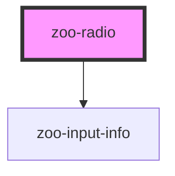

# zoo-radio

<!-- Auto Generated Below -->

## Properties

| Property   | Attribute  | Description | Type      | Default |
| ---------- | ---------- | ----------- | --------- | ------- |
| `errormsg` | `errormsg` |             | `string`  | `''`    |
| `text`     | `text`     |             | `string`  | `''`    |
| `valid`    | `valid`    |             | `boolean` | `true`  |

## Dependencies

### Depends on

- [zoo-input-info](../shared/zoo-input-info)

### Graph

----------------------------------------------

*Built with [StencilJS](https://stenciljs.com/)*
